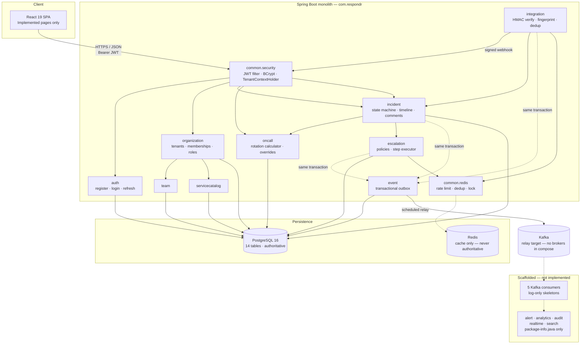
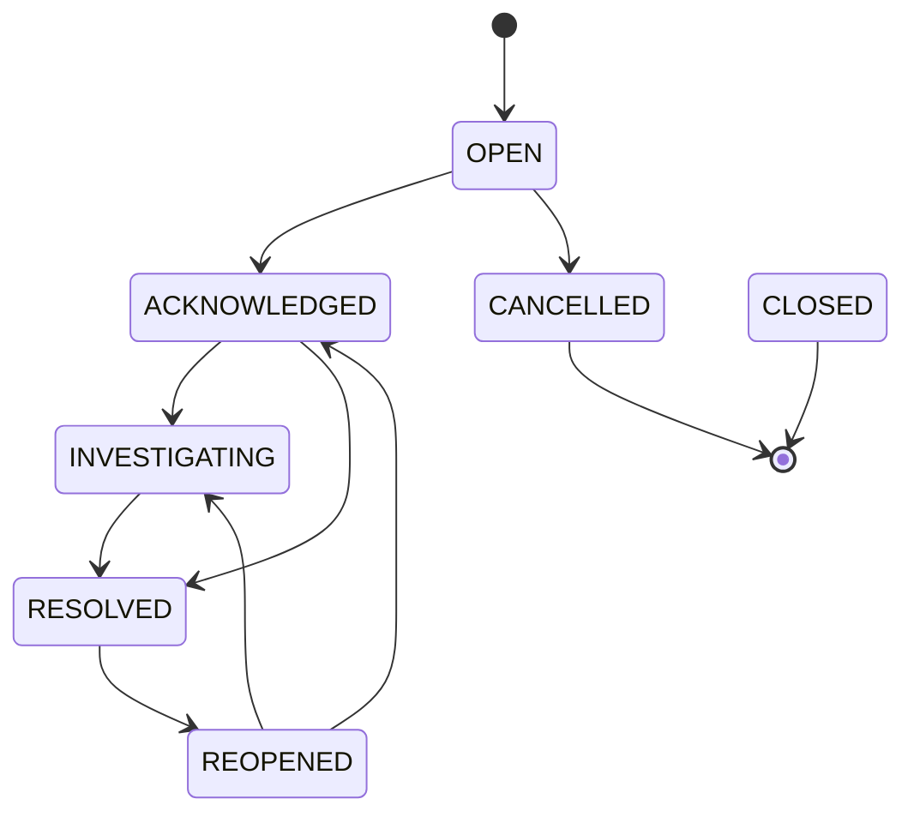

# Respondr

**A work-in-progress, multi-tenant incident management and on-call platform.**

Respondr is a Spring Boot + React application that ingests monitoring alerts over signed
webhooks, verifies and deduplicates them, opens incidents, resolves the on-call responder
for the affected service, enforces an explicit incident state machine, and records every
transition as an append-only timeline. State is written to PostgreSQL inside the same
transaction that emits a domain event through a transactional outbox, so that alert
ingestion and event publication cannot diverge.

This repository contains the portion of Respondr that is actually built. It is **not
feature-complete**, and the [Project Status](#project-status),
[Known Limitations](#known-limitations) and [Roadmap](#roadmap) sections state exactly
where the boundary sits. Nothing in this README describes work that is only planned.

---

## Table of Contents

- [Project Status](#project-status)
- [Why Respondr?](#why-respondr)
- [Core Features](#core-features)
- [Architecture](#architecture)
- [Incident Lifecycle](#incident-lifecycle)
- [Tech Stack](#tech-stack)
- [Repository Structure](#repository-structure)
- [Backend Architecture](#backend-architecture)
- [API](#api)
- [Database](#database)
- [Security](#security)
- [Event-Driven Architecture](#event-driven-architecture)
- [Real-Time Communication](#real-time-communication)
- [Local Development](#local-development)
- [Environment Variables](#environment-variables)
- [Testing](#testing)
- [Observability](#observability)
- [Deployment](#deployment)
- [Engineering Decisions](#engineering-decisions)
- [Known Limitations](#known-limitations)
- [Roadmap](#roadmap)
- [Contributing](#contributing)
- [License](#license)

---

## Project Status

**Status: active development. Not production-ready. Not deployed.**

The backend implements the core incident domain end to end — ingestion, deduplication,
lifecycle, timeline, on-call resolution, escalation execution and a transactional outbox.
The frontend implements authentication, incidents, on-call, teams and the service catalog.
Several architectural modules exist as empty package markers only, and the Kafka consumers
are deliberately unfinished.

| Area | Status |
|---|---|
| Foundation (build, layout, CI) | Implemented |
| Core backend + PostgreSQL schema | Implemented |
| Authentication (JWT, BCrypt, refresh) | Implemented |
| Tenant isolation | Implemented |
| RBAC (role-based method security) | Partial — see [Security](#security) |
| Incident management + lifecycle | Implemented |
| Incident timeline and comments | Implemented |
| Alert ingestion (webhook, HMAC, dedup) | Implemented (no management UI/API) |
| On-call scheduling and resolution | Implemented |
| Escalation policy and step execution | Implemented in service layer; not reachable via API |
| Transactional outbox | Implemented |
| Redis (rate limit, dedup cache, locking) | Implemented; not configured, never integration-tested |
| Kafka consumers | **Scaffolded only — log statements, no business logic** |
| Notifications | **Not implemented** (schema and entity only) |
| WebSocket / STOMP real-time | **Not implemented** (dependency only) |
| Elasticsearch search | **Not implemented** (no dependency) |
| Analytics (MTTA / MTTR) | **Not implemented** |
| Audit log | **Not implemented** (table exists, nothing writes to it) |
| Frontend — auth, incidents, on-call, teams, services | Implemented |
| Frontend — dashboard, integrations, analytics, audit | Placeholder pages |
| Observability | Partial — Actuator + trace IDs; no metrics export, no dashboards |
| CI/CD | Implemented for build and test; no deployment pipeline |
| Docker | **Stub** — no Dockerfiles exist |
| Kubernetes | **Not implemented** |
| AWS deployment | **Not implemented** |

---

## Why Respondr?

The problem this codebase is built around is the gap between *an alert arriving* and *a
human reliably responding to it*. Most of the engineering difficulty in that gap is not in
the CRUD — it is in the failure modes:

**Deduplication under retry.** Monitoring tools retry webhooks. Without a stable
fingerprint, one flapping check becomes fifty incidents. Respondr derives a SHA-256
fingerprint from the provider and the alert's external ID, enforces uniqueness with a
database constraint (`uq_alert_integration_fingerprint`), and uses Redis purely as a fast
path in front of that constraint. The database, not the cache, is the authority — the
cache is allowed to be wrong, because losing it only costs a query.

**Idempotent publishing.** A domain state change and its event must commit together or not
at all. `OutboxService.publishEvent` is annotated `@Transactional(propagation =
MANDATORY)`, so it is physically impossible to write an outbox event outside a caller's
transaction, and equally impossible to commit domain state without its event. The relay
then publishes asynchronously.

**At-least-once, not exactly-once.** The relay marks an event published after handing it
to Kafka; a crash between send and commit causes redelivery. This is a deliberate,
documented trade-off, and the reason every consumer is required to be idempotent. See
[Engineering Decisions](#engineering-decisions).

**Tenant isolation as a first-class invariant.** Every tenant-scoped read filters on the
`orgId` carried in the JWT, asserted in the service layer rather than trusted from the
request body. A cross-tenant access attempt raises `AccessDeniedException` before any data
is loaded.

**A state machine, not a status field.** `IncidentService.validateTransition` encodes the
legal edges explicitly and rejects everything else with a 400. An incident cannot jump
from `OPEN` straight to `RESOLVED`, and cannot be mutated out of `CANCELLED`.

**A safe on-call answer.** Determining "who is on call right now" is a rotation calculation
with timezone handling and ad-hoc overrides layered on top. `OnCallCalculator` handles
offsets correctly in both directions, and overrides always take precedence over the
computed rotation.

---

## Core Features

### Implemented

- **Multi-tenant foundation** — organizations, memberships with roles, and tenant-scoped
  isolation enforced in every service that reads tenant data.
- **Authentication** — registration creates the user, the organization, and an `OWNER`
  membership in one transaction; login issues a short-lived access JWT and a longer-lived
  refresh JWT; passwords are BCrypt-hashed.
- **Alert ingestion** — a provider-agnostic webhook endpoint that verifies an HMAC-SHA256
  signature using constant-time comparison, rate-limits per integration key, normalizes
  arbitrary JSON into a typed alert, computes a deduplication fingerprint, and resolves the
  current on-call responder to auto-assign the resulting incident.
- **Incident lifecycle** — an explicit seven-state machine with validated transitions,
  a timestamped timeline of every change, and threaded comments.
- **Service catalog and teams** — services optionally belong to a team, which is what makes
  on-call resolution possible for an alert.
- **On-call scheduling** — rotation rules with a timezone-aware calculation, plus manual
  schedule overrides that take precedence over computed rotations.
- **Escalation** — policies with ordered steps and delays, and a step executor that halts on
  acknowledgement, guards against re-execution, and schedules the next step.
- **Transactional outbox** — domain events are written in the caller's transaction and
  relayed to Kafka by a background scheduler.
- **Trace correlation** — every request carries an `X-Trace-Id` that appears in the error
  response and the logging MDC.

### In Progress

- **Kafka consumers** — the five consumers (notification, realtime, search indexer,
  analytics, audit) parse the envelope, de-duplicate via an in-memory tracker, log, and
  return. They are structural scaffolding with no business logic.
- **RBAC** — method-level `@PreAuthorize` is used for role checks, but the escalation
  controller's annotations reference a bean that does not exist (see
  [Known Limitations](#known-limitations)).
- **Frontend coverage** — four of twelve routes are implemented; dashboard, integrations,
  analytics and audit are placeholders.
- **Redis usage** — implemented and unit-tested with a mocked template, but never exercised
  against a real Redis, and not configured in `application.yml`.

### Planned

Not started. Listed here to show the intended shape of the system, not as a claim about
what exists:

- Real-time incident updates over WebSocket/STOMP.
- Elasticsearch-backed search and the `alert` domain package.
- Notification dispatch (email, Slack, PagerDuty).
- MTTA/MTTR analytics and SLA reporting.
- Immutable audit log writes.
- Kubernetes manifests, AWS infrastructure, and a deployment pipeline.
- Metrics export (Prometheus), Grafana dashboards, and OpenTelemetry tracing.

---

## Architecture

A **modular monolith** organised package-per-domain. One deployable unit, one database,
one transaction boundary. This is recorded as a decision in
[ADR-0001](docs/adr/ADR-0001-modular-monolith.md), which also defines the objective
conditions under which a domain would be extracted into a service.

The following diagram shows **only what exists in this repository**. Modules drawn as
"package marker" contain a single `package-info.java` and no implementation; the Kafka
consumers are present but contain no business logic.



**Not shown, because it does not exist:** Elasticsearch, a notification dispatcher, a
WebSocket broker, a metrics pipeline, and any Kubernetes or AWS resource.

---

## Incident Lifecycle

`IncidentStatus` defines seven states. `IncidentService.validateTransition` encodes the
legal edges and rejects every other pair with `400 Bad Request`. Transitions are exposed as
dedicated endpoints, so a caller cannot set an arbitrary status.



| From | Permitted targets |
|---|---|
| `OPEN` | `ACKNOWLEDGED`, `CANCELLED` |
| `ACKNOWLEDGED` | `INVESTIGATING`, `RESOLVED` |
| `INVESTIGATING` | `RESOLVED` |
| `RESOLVED` | `REOPENED` |
| `REOPENED` | `ACKNOWLEDGED`, `INVESTIGATING` |
| `CANCELLED` | *(terminal)* |
| `CLOSED` | *(terminal; declared but not reachable through any endpoint)* |

A transition to `RESOLVED` stamps `resolvedAt`; moving out of `RESOLVED` clears it. Each
accepted transition writes an `IncidentEvent` to the timeline and — for the four statuses
with a corresponding domain event — an entry to the outbox.

---

## Tech Stack

Only technologies present in the repository are listed. "Status" reflects actual usage.

| Category | Technology | Usage | Status |
|---|---|---|---|
| Language | Java 21 | Backend, compiled via `maven.compiler.release` | In use |
| Framework | Spring Boot 3.3.4 | Application runtime, auto-configuration | In use |
| Security | Spring Security | Stateless JWT filter chain, BCrypt, method security | In use |
| Auth | JJWT 0.12.6 | Access + refresh token issue and validation | In use |
| Persistence | Spring Data JPA / Hibernate 6 | Entities and repositories | In use |
| Database | PostgreSQL 16 | Authoritative store for all state | In use |
| Migrations | Flyway | 5 versioned migrations, 14 tables | In use |
| Cache | Redis (`spring-boot-starter-data-redis`) | Rate limiting, dedup fast path, distributed lock | Implemented, unconfigured, untested against a real server |
| Messaging | Apache Kafka (`spring-kafka`) | Outbox relay target; 5 consumers present but empty | **Scaffolded only** |
| Build | Maven | Backend build, `clean verify` | In use |
| Language | TypeScript ~6.0 | Frontend | In use |
| UI | React 19, React Router 7 | Frontend SPA | In use |
| Build | Vite 8 | Frontend dev server and bundler | In use |
| Lint | oxlint | Frontend linting | In use |
| Test | JUnit 5, Mockito | Unit tests | In use |
| Test | Spring Security Test | MockMvc security assertions | In use |
| Test | Testcontainers (PostgreSQL, Kafka) | Repository and integration tests | In use; **skips when Docker is unavailable** |
| Test | H2 (PostgreSQL mode) | Test profile database | In use |
| Test | Vitest 5, Testing Library, jsdom | Frontend tests | In use |
| CI | GitHub Actions | Backend verify + frontend build | In use |
| WebSocket | `spring-boot-starter-websocket` | Declared dependency | **Unused — no configuration or client** |
| Elasticsearch | — | — | **Not present** |
| OpenTelemetry | — | — | **Not present** |
| Prometheus client | — | Actuator endpoints exposed: `health`, `info`, `metrics` | **`/actuator/prometheus` does not exist** |

---

## Repository Structure

```
respondr/
├── backend/                        Spring Boot application (Maven)
│   ├── pom.xml
│   └── src/
│       ├── main/
│       │   ├── java/com/respondr/
│       │   │   ├── RespondrApplication.java
│       │   │   ├── auth/           Authentication, users, JWT DTOs
│       │   │   ├── organization/   Tenants, memberships, roles
│       │   │   ├── team/           Teams
│       │   │   ├── servicecatalog/ Services, environments
│       │   │   ├── integration/    Webhook ingestion, HMAC, alerts
│       │   │   ├── incident/       Incidents, comments, timeline
│       │   │   ├── oncall/         Schedules, overrides, rotation
│       │   │   ├── escalation/     Policies, steps, execution
│       │   │   ├── notification/   Entity + repository only
│       │   │   ├── event/          Transactional outbox, Kafka consumers
│       │   │   ├── common/
│       │   │   │   ├── security/   JWT, CORS, tenant context
│       │   │   │   ├── exception/  Error contract, global handler
│       │   │   │   ├── persistence/  Audited base entity
│       │   │   │   ├── redis/      Cache, rate limit, lock
│       │   │   │   └── web/        Trace ID filter
│       │   │   ├── alert/          package-info.java only
│       │   │   ├── analytics/      package-info.java only
│       │   │   ├── audit/          package-info.java only
│       │   │   ├── realtime/       package-info.java only
│       │   │   └── search/         package-info.java only
│       │   └── resources/
│       │       ├── application.yml
│       │       └── db/migration/   V1 … V5
│       └── test/                   19 test classes
├── frontend/                       React + TypeScript (Vite)
│   ├── src/
│   │   ├── api/                    Fetch client with 401 refresh-and-replay
│   │   ├── components/             AppShell, ProtectedRoute
│   │   ├── context/                Auth context
│   │   ├── pages/                  Login, Incidents, IncidentDetail, OnCall,
│   │   │                           Teams, Services, Organizations, Placeholder
│   │   ├── __tests__/              4 Vitest files
│   │   └── types/
│   └── package.json
├── infra/
│   ├── prometheus/prometheus.yml   Scrape config (target endpoint not exposed)
│   └── grafana/README.md           Planned dashboards — none exist
├── docs/
│   ├── adr/                        ADR-0001, ADR-0002
│   └── architecture/overview.md    Intended architecture
├── .github/workflows/ci.yml
├── .env.example
└── docker-compose.yml              Stub — no Dockerfiles exist
```

---

## Backend Architecture

**Package-per-domain.** Each domain owns its entities, repositories, services, controllers
and DTOs. Cross-domain calls are direct Java method calls; there is no internal REST or
RPC layer.

**Layering.** `Controller` (HTTP concerns, `@Valid`, `Pageable`) → `Service` (transaction
boundary, tenant assertion, business rules) → `Repository` (Spring Data). This is
conventional layering, not DDD aggregates; the codebase does not model domain events as
first-class objects, and repositories return managed entities that services map to DTOs.

**DTO mapping is hand-written.** There is no MapStruct. Each response DTO exposes a static
`from(entity)` factory. This is explicit and easy to follow, at the cost of repetition.

**Validation** uses Jakarta Bean Validation (`@Valid`, `@NotBlank`, `@NotNull`, `@Email`,
`@Size`) on request DTOs, enforced in controllers. Failures are collected by
`GlobalExceptionHandler` and returned as a single 400.

**Transactions.** Services are annotated `@Transactional(readOnly = true)` at class level
and `@Transactional` on mutating methods. `open-in-view` is disabled, so lazy loading must
happen inside a service method — the code is written accordingly.

**Error contract.** A single `ErrorResponse` shape for every failure:

```json
{
  "timestamp": "2026-09-27T01:48:00Z",
  "status": 400,
  "code": "BAD_REQUEST",
  "message": "Invalid status transition from OPEN to RESOLVED",
  "path": "/api/v1/incidents/{id}/resolve",
  "traceId": "0f2c…"
}
```

`GlobalExceptionHandler` maps `ApiException` (carrying an explicit status), `AccessDeniedException`,
`AuthenticationException`, `MethodArgumentNotValidException`, `DataIntegrityViolationException`,
and a catch-all `Exception` to 500.

**Tenant isolation** is enforced by the service layer. `JwtAuthenticationFilter` populates a
thread-local `TenantContextHolder.TenantContext` (org, user, role, email) and clears it in a
`finally` block. Services read the org from that context and call a private
`assertOrgAccess(...)` before returning or mutating tenant data. Note that this is an
application-level check — there is no Hibernate filter or database row-level security, so
isolation depends on every query remembering to scope itself.

**No optimistic locking.** No entity carries a `@Version` field, so concurrent updates rely
on the database constraints alone. This is a known gap, listed under
[Known Limitations](#known-limitations).

---

## API

All endpoints are versioned under `/api/v1`. There is **no OpenAPI/Swagger specification and
no springdoc dependency** — the table below is the source of truth.

**Authentication:** `Public` means no credentials required. `JWT` means a valid
`Authorization: Bearer <access token>` whose `type` claim is `ACCESS`. All authenticated
requests also require the token to carry an `orgId`, which becomes the tenant scope.

### `/api/v1/auth` — Public

| Method | Endpoint | Purpose | Auth |
|---|---|---|---|
| POST | `/auth/login` | Exchange credentials for access + refresh tokens | Public |
| POST | `/auth/register` | Create user, organization and `OWNER` membership | Public |
| POST | `/auth/refresh` | Exchange a refresh token for a new token pair | Public |

### `/api/v1/webhooks` — Public

| Method | Endpoint | Purpose | Auth |
|---|---|---|---|
| POST | `/webhooks/{integrationKey}` | Ingest a monitoring alert; verifies HMAC, deduplicates, opens an incident, resolves on-call | Public (integrity via signature) |

Signature is read from the first present of `X-Signature`, `X-Hub-Signature-256`, or
`X-Webhook-Signature`. Responds `200` with `{status, alertId, incidentId}` where `status` is
`INGESTED` or `DUPLICATE`.

### `/api/v1/incidents` — JWT

| Method | Endpoint | Purpose | Auth |
|---|---|---|---|
| GET | `/incidents` | List incidents for the tenant, paginated (default 20, sorted by `createdAt`) | JWT |
| GET | `/incidents/{id}` | Fetch one incident | JWT |
| POST | `/incidents` | Create an incident manually (`source = MANUAL`) | JWT |
| POST | `/incidents/{id}/acknowledge` | `OPEN` → `ACKNOWLEDGED` | JWT |
| POST | `/incidents/{id}/investigate` | → `INVESTIGATING` | JWT |
| POST | `/incidents/{id}/resolve` | → `RESOLVED`; stamps `resolvedAt` | JWT |
| POST | `/incidents/{id}/reopen` | `RESOLVED` → `REOPENED` | JWT |
| POST | `/incidents/{id}/cancel` | `OPEN` → `CANCELLED` | JWT |
| GET | `/incidents/{id}/timeline` | Ordered incident events | JWT |
| GET | `/incidents/{id}/comments` | Comments, oldest first | JWT |
| POST | `/incidents/{id}/comments` | Add a comment | JWT |

### `/api/v1/organizations` — JWT

| Method | Endpoint | Purpose | Auth |
|---|---|---|---|
| GET | `/organizations` | List organizations | JWT |
| GET | `/organizations/{id}` | Fetch one organization | JWT |
| GET | `/organizations/slug/{slug}` | Look up by slug | JWT |
| POST | `/organizations` | Create | JWT |
| PATCH | `/organizations/{id}` | Update name | JWT |
| DELETE | `/organizations/{id}` | Delete | JWT |

### `/api/v1/teams` and `/api/v1/organizations/{orgId}/teams` — JWT

| Method | Endpoint | Purpose | Auth |
|---|---|---|---|
| GET | `/organizations/{orgId}/teams` | List teams | JWT |
| GET | `/teams/{id}` | Fetch one team | JWT |
| POST | `/organizations/{orgId}/teams` | Create team | JWT |
| PATCH | `/teams/{id}` | Update team | JWT |
| DELETE | `/teams/{id}` | Delete team | JWT |

### `/api/v1/services` and `/api/v1/organizations/{orgId}/services` — JWT

| Method | Endpoint | Purpose | Auth |
|---|---|---|---|
| GET | `/organizations/{orgId}/services` | List services | JWT |
| GET | `/services/{id}` | Fetch one service | JWT |
| POST | `/organizations/{orgId}/services` | Register a service | JWT |
| PATCH | `/services/{id}` | Update service | JWT |
| DELETE | `/services/{id}` | Delete service | JWT |

### `/api/v1/on-call` — JWT

| Method | Endpoint | Purpose | Auth |
|---|---|---|---|
| GET | `/on-call/schedules` | List schedules | JWT |
| GET | `/on-call/schedules/{id}` | Fetch one schedule | JWT |
| POST | `/teams/{teamId}/on-call/schedules` | Create a schedule with rotation rules | JWT |
| DELETE | `/on-call/schedules/{id}` | Delete a schedule | JWT |
| GET | `/on-call/schedules/{id}/current-responder` | Resolve who is on call now | JWT |
| GET | `/on-call/schedules/{id}/overrides` | List overrides | JWT |
| POST | `/on-call/schedules/{id}/overrides` | Create an override | JWT |

### `/api/v1/organizations/{orgId}/escalation-policies` — JWT *(currently non-functional)*

| Method | Endpoint | Purpose | Auth |
|---|---|---|---|
| POST | `/escalation-policies` | Create a policy | JWT + `ADMIN`/`INCIDENT_MANAGER` |
| GET | `/escalation-policies` | List policies | JWT + `VIEW` |
| GET | `/escalation-policies/{policyId}` | Fetch a policy | JWT + `VIEW` |
| PATCH | `/escalation-policies/{policyId}` | Update name/active | JWT + `ADMIN`/`INCIDENT_MANAGER` |
| DELETE | `/escalation-policies/{policyId}` | Delete a policy | JWT + `ADMIN` |
| POST | `/escalation-policies/{policyId}/steps` | Add a step | JWT + `ADMIN`/`INCIDENT_MANAGER` |
| GET | `/escalation-policies/{policyId}/steps` | List steps | JWT + `VIEW` |
| DELETE | `/escalation-policies/{policyId}/steps/{stepId}` | Delete a step | JWT + `ADMIN`/`INCIDENT_MANAGER` |

> **These eight endpoints do not work at runtime.** Their `@PreAuthorize` expressions call
> `@tenantSecurity.hasOrgRole(...)` and `@tenantSecurity.hasOrgPermission(...)`, but no
> `tenantSecurity` bean is defined anywhere in the codebase. Every invocation fails. The
> `EscalationService` methods behind them are implemented and unit-tested. See
> [Known Limitations](#known-limitations).

### `/actuator` — Public

| Method | Endpoint | Purpose | Auth |
|---|---|---|---|
| GET | `/actuator/health` | Health check | Public |
| GET | `/actuator/info` | Build info | Public |
| GET | `/actuator/metrics` | Micrometer metric names | Public |

`/actuator/prometheus` is **not** exposed.

---

## Database

PostgreSQL is the authoritative store. Flyway owns the schema; Hibernate runs with
`ddl-auto: validate`, so a schema drift fails fast at startup instead of silently.

Five migrations create **14 tables**:

| Migration | Tables |
|---|---|
| `V1__initial_schema.sql` | `organizations`, `users`, `memberships`, `teams`, `services`, `environments`, `incidents`, `incident_events`, `comments`, `audit_logs`, `outbox_events` |
| `V2__alert_ingestion_and_incidents.sql` | `alert_integrations`, `alerts` |
| `V3__on_call_and_scheduling.sql` | `on_call_schedules`, `schedule_overrides` |
| `V4__escalation_policies.sql` | `escalation_policies`, `escalation_steps`, `incident_escalation_states` |
| `V5__notifications_schema.sql` | `notifications` |

**Key relationships**

```
organizations ─┬─< memberships >─ users
               ├─< teams ─┬─< services ─< environments
               │         └─< on_call_schedules ─< schedule_overrides >─ users
               ├─< services
               ├─< alert_integrations ─< alerts >─ incidents
               ├─< escalation_policies ─┬─< escalation_steps
               │                        └─< incident_escalation_states >─ incidents
               ├─< incidents ─┬─< incident_events
               │              ├─< comments
               │              └─< notifications
               ├─< notifications
               └─< audit_logs        (no writer — see limitations)
```

**Multi-tenancy.** Eleven tables carry a tenant column (`org_id`), and all eleven index it.
Tenant scope is enforced in the application layer, not by the database.

**Constraints that carry real weight**

- `uq_user_email`, `uq_organization_slug`, `uq_membership_org_user` — identity uniqueness.
- `uq_service_org_key` — service keys are unique per tenant, not globally.
- `uq_alert_integration_fingerprint (integration_id, fingerprint)` — **the deduplication
  guarantee.** Alert ingestion relies on this constraint as its final backstop after the
  Redis fast path.
- `uq_escalation_step_policy_order (policy_id, step_order)` — step ordering.
- `incident_escalation_states.incident_id` is `UNIQUE` — one escalation chain per incident.
- `chk_override_dates CHECK (end_at > start_at)` — override windows must be well-formed.
- `ON DELETE CASCADE` on tenant-owned children; `ON DELETE SET NULL` on optional incident
  links (service, team, assignee), so deleting a service does not destroy incident history.

**Indexes for the real query paths.** Incidents are indexed on
`(org_id, status, created_at DESC)`, `(org_id, service_id, created_at DESC)` and
`(org_id, severity, created_at DESC)` — matching the list and filter queries. The outbox
relay is served by `idx_outbox_event_status_created (status, created_at ASC)`, and the
escalation poller would be served by `idx_incident_escalation_next_exec
(status, next_execution_at ASC)`.

**Tenancy caveat.** `incident_events`, `notifications` and `incident_escalation_states`
have no `org_id`; they are reached through a parent that does. Fine as written, but it
means tenant scoping for those tables depends on the join path.

---

## Security

**Implemented controls**

| Control | Implementation |
|---|---|
| Stateless authentication | `SessionCreationPolicy.STATELESS`; no server-side session, no CSRF token |
| JWT issuance and validation | JJWT 0.12.6, HMAC signing, `Jwts.parser().verifyWith(...)` |
| Token types | `ACCESS` and `REFRESH` claims; the filter rejects refresh tokens on API calls, and `/auth/refresh` rejects access tokens |
| Expiry | Access 15 min, refresh 7 days |
| Password hashing | `BCryptPasswordEncoder` via a `PasswordEncoder` bean |
| Role-based access | `@EnableMethodSecurity` with `hasAnyRole(...)` / `hasRole(...)` on service methods |
| Tenant isolation | `orgId` claim → `TenantContextHolder` → `assertOrgAccess(...)` in services |
| CORS | Explicit allow-list: `http://localhost:*` and `http://127.0.0.1:*` only |
| Webhook integrity | HMAC-SHA256 verified with `MessageDigest.isEqual` (constant-time) |
| Rate limiting | Per-integration fixed-window limit, 100 requests / 60 s, via Redis |
| Input validation | Jakarta Bean Validation on all request DTOs |
| Error hygiene | `GlobalExceptionHandler` returns a generic message for unhandled exceptions; stack traces are logged, not returned |
| Request correlation | `X-Trace-Id` accepted or generated, placed in MDC and echoed in responses and errors |

**Public surface.** Only `/api/v1/auth/**`, `/api/v1/webhooks/**`, `/actuator/health` and
`/error` are `permitAll`. Everything else requires a valid access token.

**Not implemented**

- No refresh-token revocation or rotation tracking — tokens are stateless and valid until
  expiry.
- No rate limiting on `/auth/**`, so login is not brute-force protected.
- No account lockout, MFA, or password-reset flow.
- Tokens are stored in `localStorage` on the client, so they are reachable by any XSS.
- No secure-headers configuration (no CSP, `HSTS`, or `X-Content-Type-Options`).
- `JWT_SECRET` has a working development default baked into `application.yml`. **It must be
  overridden for any non-local deployment.** There is no startup guard that rejects it.
- The `tenantSecurity` bean referenced by `EscalationController` is missing, so those
  endpoints fail rather than enforce their role checks.

---

## Event-Driven Architecture

The **transactional outbox** is implemented and is the part of this design that is real.

**Write path.** `OutboxService.publishEvent` is annotated
`@Transactional(propagation = Propagation.MANDATORY)`. Spring throws
`IllegalArgumentException` if no transaction is already active, so an outbox event cannot
be written outside — or committed independently from — the domain change that produced it.
Every mutation in `IncidentService`, `WebhookIngestionService` and `EscalationService` calls
it in the same transaction as its state change.

**Envelope.** `DomainEventEnvelope` is a record carrying `eventId` (UUID), `eventType`,
`aggregateId`, `organizationId`, `occurredAt`, `schemaVersion` and a `payload` map. The
serialized envelope is stored in `outbox_events.payload` (JSONB).

**Relay.** `OutboxPublisherScheduler` runs on a fixed 1-second delay, reads up to 50
`PENDING` rows ordered by `created_at`, sends each to a topic chosen by event type, and
marks it `PUBLISHED`. Topic routing:

| Event types | Topic |
|---|---|
| `IncidentCreated`, `IncidentAcknowledged`, `IncidentEscalated`, `IncidentResolved`, `IncidentReopened` | `respondr.incidents` |
| `CommentAdded` | `respondr.comments` |
| `AlertReceived` | `respondr.alerts` |
| anything else | `respondr.events` |

**Delivery semantics: at-least-once.** Not exactly-once. If the relay crashes between the
Kafka send and the database commit, the event is re-sent after restart. The class javadoc
states this explicitly, and it is the correct trade-off for this design.

**Idempotency.** `IdempotencyTracker` keys on `consumerGroup:eventId` in a
`ConcurrentHashMap`. It correctly suppresses redelivery **within a single process
lifetime**, and that is all it does — the set is in-memory, so a restart loses it. A durable
implementation would need a unique constraint on `event_id` per consumer.

**Consumers are scaffolds.** `AnalyticsEventConsumer`, `AuditEventConsumer`,
`NotificationEventConsumer`, `RealtimeEventConsumer` and `SearchIndexerEventConsumer` all
follow the same shape: parse the envelope, call `markIfNew`, log, and return. Each contains
a comment marking the business logic as future work. **No consumer performs any business
action today.**

**Known relay defect.** The relay marks an event `PUBLISHED` even when `kafkaTemplate` is
absent, and it does not check the outcome of the asynchronous `send(...)` before marking.
A failed or unconfigured send therefore silently loses the event. This is recorded in
[Known Limitations](#known-limitations).

**Redis's role.** Coordination and acceleration only. Every Redis operation is wrapped so
that a Redis failure falls back to the PostgreSQL path — the system is correct without
Redis, only slower.

---

## Real-Time Communication

**Not implemented.** There is no WebSocket or STOMP functionality in this repository.

- `spring-boot-starter-websocket` is a declared dependency, but there is no
  `@EnableWebSocketMessaging`, no `WebSocketMessageBrokerConfigurer`, no broker relay and
  no endpoint registration.
- `com.respondr.realtime` contains exactly one file: `package-info.java`.
- `RealtimeEventConsumer` is a log-only skeleton whose comment reads *"Skeleton placeholder
  for Phase 8 STOMP WebSocket broadcasting logic"*.
- The frontend has no `sockjs-client`, no `@stomp/stompjs`, and no WebSocket, `EventSource`
  or polling code. Incident pages fetch on mount and re-fetch after a mutation.

The dependency is there because the design intends to add it. Treat real-time as planned,
not present.

---

## Local Development

### Prerequisites

- **Java 21** (the project targets 21; it also compiles and tests successfully on newer JDKs)
- **Maven 3.9+**
- **Node.js 20+**
- **PostgreSQL 16** — required; Flyway will create the schema on first run
- **Docker** — *optional*, only needed to run the Testcontainers-based tests
- **Redis** — *optional*, the backend degrades gracefully without it
- **Kafka** — *optional*, the outbox relay logs and marks events published without it

### 1. Clone

```bash
git clone https://github.com/tdk-netsec14/Respondr.git
cd Respondr
```

### 2. Database

```bash
docker run -d --name respondr-postgres \
  -e POSTGRES_DB=respondr \
  -e POSTGRES_USER=respondr \
  -e POSTGRES_PASSWORD=respondr \
  -p 5432:5432 postgres:16
```

Flyway applies `V1`–`V5` automatically on first backend start. There is no separate
migration step.

### 3. Environment

```bash
cp .env.example .env
```

The defaults work for the local PostgreSQL container above. For a non-local run, set
`JWT_SECRET` to your own value — see [Security](#security).

### 4. Backend

```bash
cd backend
mvn spring-boot:run
```

Starts on `http://localhost:8080`. Verify with `curl http://localhost:8080/actuator/health`.

### 5. Frontend

```bash
cd frontend
npm install
npm run dev
```

Starts on `http://localhost:5173`.

> **Known gap:** `frontend/vite.config.ts` defines no dev proxy, and `apiClient.ts` uses the
> relative base `/api/v1`. As it stands, the dev server will not forward API calls to the
> backend — you will need to add a proxy rule for `/api` → `http://localhost:8080` (or serve
> a production build behind a single origin). This is listed in
> [Known Limitations](#known-limitations).

### Running with Docker

**Not currently possible.** `docker-compose.yml` references `backend/Dockerfile` and
`frontend/Dockerfile`, neither of which exists, and all datastore services are commented
out. See [Deployment](#deployment).

---

## Environment Variables

Variables actually read by `backend/src/main/resources/application.yml`:

| Variable | Default | Used for |
|---|---|---|
| `SPRING_PROFILES_ACTIVE` | — | Active Spring profile |
| `DB_HOST` | `localhost` | JDBC host |
| `DB_PORT` | `5432` | JDBC port |
| `DB_NAME` | `respondr` | Database name |
| `DB_USERNAME` | `respondr` | Database user |
| `DB_PASSWORD` | `respondr` | Database password |
| `JWT_SECRET` | *(dev default in `application.yml`)* | HMAC signing key for access and refresh tokens |

Token lifetimes are **not** environment-driven. They are literals in `application.yml`:
`respondr.jwt.access-token-expiration-ms` (900000 = 15 min) and
`respondr.jwt.refresh-token-expiration-ms` (604800000 = 7 days).

Redis, Kafka, Elasticsearch, AWS and OpenTelemetry variables appear in `.env.example` as
placeholders but are **not read by any code path** — there is no `spring.data.redis.*`,
`spring.kafka.*`, or telemetry configuration. See
[Known Limitations](#known-limitations).

No secret value is committed to this repository. `.env` is gitignored; `.env.example`
contains placeholders only.

---

## Testing

### Backend

```bash
mvn -f backend/pom.xml test       # unit + integration
mvn -f backend/pom.xml verify     # full build including packaging
```

19 test classes, 67 test methods.

| Category | Mechanism | Examples |
|---|---|---|
| Unit + Mockito | `@ExtendWith(MockitoExtension.class)` | `AuthServiceTest`, `JwtServiceTest`, `EscalationServiceTest`, `OnCallCalculatorTest`, `RedisServiceTest`, `OrganizationServiceTest` |
| Pure unit | No Spring context | `IncidentLifecycleTest` (state machine), `HmacUtilsTest`, `WebhookRateLimitTest` |
| Web slice | `@WebMvcTest` + `@MockBean` | `OrganizationControllerTest` (10 tests) |
| Repository | `@DataJpaTest` + Testcontainers PostgreSQL | `OrganizationRepositoryTest`, `TeamRepositoryTest`, `ServiceRepositoryTest` |
| Integration | `@SpringBootTest` + `@AutoConfigureMockMvc` + Testcontainers | `SecurityAndTenantIsolationTest`, `WebhookIngestionTest`, `KafkaOutboxIntegrationTest` |
| Smoke | `@SpringBootTest` | `RespondrApplicationTests` (`contextLoads`) |

The two base classes, `AbstractIntegrationTest` and `AbstractRepositoryTest`, are annotated
`@Testcontainers(disabledWithoutDocker = true)`. **Without a running Docker daemon, those 19
tests are silently skipped** rather than failed.

`KafkaOutboxIntegrationTest` is named for Kafka but **does not use a Kafka broker**. It runs
against H2 with `spring.kafka.listener.auto-startup: false` and exercises the outbox write
path, the relay's status transitions and topic routing, and `IdempotencyTracker`. The Kafka
container dependency in `pom.xml` is currently unused.

**Verified result on this repository** (`mvn clean verify`, Java 25, no Docker daemon):

```
Tests run: 67, Failures: 0, Errors: 0, Skipped: 19
BUILD SUCCESS
```

The 19 skipped are the Docker-dependent tests. On CI, where a Docker daemon is available,
all 67 are expected to execute — but that has not been verified here.

### Frontend

```bash
cd frontend
npm test          # vitest run
npm run build     # tsc -b && vite build
npm run lint      # oxlint
```

**Verified result on this repository:**

```
Test Files  4 passed (4)
Tests       5 passed (5)
```

`npm run build` completes successfully (`tsc -b` type-check + Vite bundle).

### What the tests do not cover

This is a real gap and worth stating plainly:

- The 19 Docker-dependent tests — including **cross-tenant isolation** and **webhook
  ingestion end to end** — were not executed in the environment above. They have test code
  and are expected to pass on CI, but that is not something this repository can prove.
- The frontend suite is five render-level smoke tests. There is no coverage of incident
  state transitions, comment posting, schedule creation, overrides, the 401
  refresh-and-replay path, or any error branch. `TeamsServicesCrud.test.tsx` renders only
  `TeamsPage` and asserts one string — despite its name it tests no CRUD.
- No coverage tooling is configured (no `test:coverage` script, no coverage provider).
- CI runs `npm run build` but **never runs `npm test`**, so frontend test failures would
  not block a merge.

---

## Observability

**Implemented**

- **Spring Boot Actuator**, exposing `health`, `info` and `metrics`. Health details are
  shown (`show-details: always`).
- **Trace correlation.** `TraceIdFilter` reads `X-Trace-Id` or generates a UUID, places it
  in the SLF4J MDC under `traceId`, and echoes it on the response. `GlobalExceptionHandler`
  reads the same MDC value, so every error body carries the trace ID that produced it.
- **Application logging** via SLF4J, with `com.respondr` at `DEBUG`.

**Not implemented**

- **No metrics export.** `micrometer-registry-prometheus` is not a dependency, and
  `prometheus` is not in the exposed-endpoint list. `infra/prometheus/prometheus.yml`
  scrapes `http://backend:8080/actuator/prometheus`, which returns 404 today.
- **No Grafana dashboards.** `infra/grafana/README.md` lists four planned dashboards; no
  dashboard JSON exists.
- **No OpenTelemetry.** No instrumentation dependency. `OTEL_EXPORTER_OTLP_ENDPOINT` in
  `.env.example` is unused.
- **No structured logging.** Output is plain SLF4J text with an MDC key, not JSON logs.
- **No alerting rules**, no dashboards, no SLO instrumentation.

The `common/observability` package contains only a `package-info.java`.

---

## Deployment

**No deployment has been performed. Respondr has never been deployed to any environment.**

- **Docker — stub.** `docker-compose.yml` exists but references `backend/Dockerfile` and
  `frontend/Dockerfile`, neither of which exists, so neither build can succeed. Both declared
  services sit behind the `full` profile, and PostgreSQL, Redis, Kafka, Elasticsearch,
  Prometheus and Grafana are all commented out. A plain `docker compose up` starts nothing.
- **Kubernetes — absent.** No manifests, no Helm chart, no kustomization. `infra/` has no
  Kubernetes directory.
- **AWS — absent.** `infra/aws/` is an empty directory. There is no CDK, CloudFormation or
  Terraform. AWS variables in `.env.example` are unused.
- **CI/CD — build only.** `.github/workflows/ci.yml` runs on push and pull request to `main`
  and `develop`: a backend job (Java 21, `mvn clean verify`, uploads Surefire reports) and a
  frontend job (Node 20, `npm ci`, `npm run build`, uploads `dist/`). There is no image
  build, no registry push, no environment deployment, and no frontend test step.
- **Grafana and Prometheus** are configuration stubs only.

AWS deployment architecture is not designed or implemented in this repository, and no
production deployment has been completed.

---

## Engineering Decisions

Formal decisions are recorded in [`docs/adr/`](docs/adr/):

- **[ADR-0001 — Modular Monolith over Microservices](docs/adr/ADR-0001-modular-monolith.md)** (Accepted, 2026-09-26).
  Package-per-domain, one deployable unit, extraction only when a domain is independently
  scalable, has a distinct SLA, or is owned by a separate team.
- **[ADR-0002 — Java 21 with Spring Boot 3.3](docs/adr/ADR-0002-java21-springboot3.md)** (Accepted, 2026-09-26).
  Note: this ADR records enabling virtual threads, but
  `spring.threads.virtual.enabled` is **not** set in `application.yml`. The decision was not
  carried into the implementation.

Decisions embodied in the code:

- **PostgreSQL is the single source of truth.** Redis holds only derived, expiring data
  (dedup fingerprints, rate-limit counters, short-lived locks). Every Redis call is wrapped
  in a try/catch that falls back to the database, so the system remains correct if Redis
  disappears entirely.
- **Deduplication is enforced by a database constraint, not by the cache.** Redis is a fast
  path; `uq_alert_integration_fingerprint` is the guarantee. `WebhookIngestionService` also
  catches `DataIntegrityViolationException` as a third line of defence, because a cache miss
  and a race can both defeat the application-level check.
- **The outbox uses `Propagation.MANDATORY`.** This makes the invariant structural rather
  than conventional — you cannot publish an event outside a transaction even by mistake.
- **At-least-once delivery, explicitly.** The relay's javadoc documents that a crash between
  send and commit causes redelivery, and states that consumers must therefore be idempotent.
  Exactly-once is not claimed anywhere.
- **Dedicated transition endpoints instead of a generic status update.** The client cannot
  request an illegal state; the server still validates, but the API shape makes the legal
  moves explicit.
- **Tenant scope comes from the token, never the request.** Service methods read `orgId`
  from `TenantContextHolder` and assert it against the loaded entity, so a caller cannot
  select a tenant by supplying a path parameter.
- **HMAC verification is constant-time.** `HmacUtils` uses `MessageDigest.isEqual` rather
  than `String.equals`, avoiding a timing side channel on the signature.

---

## Known Limitations

This project is intentionally incomplete. The list below is accurate as of this commit.

### Functional gaps

1. **The eight escalation endpoints fail at runtime.** `EscalationController`'s
   `@PreAuthorize` expressions reference a `tenantSecurity` bean (`hasOrgRole`,
   `hasOrgPermission`) that is not defined anywhere. The underlying `EscalationService` is
   implemented and unit-tested; only the HTTP surface is broken.
2. **Escalation is never triggered.** `EscalationService.executeEscalationStep` is correct
   and tested, but nothing calls it. There is no scheduler polling
   `incident_escalation_states.next_execution_at` — the index that would serve such a query
   exists, but the query does not. `initiateEscalation` is likewise never invoked.
3. **No Kafka consumer does any work.** All five consumers parse, de-duplicate in memory, log
   and return.
4. **The outbox relay can silently drop events.** It marks an event `PUBLISHED` even when
   `KafkaTemplate` is absent, and does not wait for the asynchronous `send` to succeed.
5. **Idempotency is in-memory only.** `IdempotencyTracker` uses a `ConcurrentHashMap`, so
   duplicate suppression does not survive a restart and is not shared across replicas.
6. **No alert-integration management.** `AlertIntegration` rows must be inserted directly
   into the database; there is no API or UI to create, rotate or deactivate an integration
   key or its secret. There is also no `alert` domain package.
7. **`AuthService.login` has a membership lookup defect.** It calls
   `membershipRepository.findByOrganizationId(user.getId())`, passing a *user* ID to a method
   that queries by *organization*. When it returns empty the code falls back to
   `membershipRepository.findAll()` and filters in memory, so logins work but at the cost of
   a full table scan.
8. **Notifications are not implemented.** `Notification`, `NotificationRepository` and the
   `notifications` table exist; nothing writes to them. The only channel constant is
   `IN_APP`.
9. **The audit log is never written.** `audit_logs` is created and indexed in `V1`, but
   there is no `AuditLog` entity and no write path. `AuditEventConsumer` is a skeleton.
10. **CLOSED is unreachable.** `IncidentStatus.CLOSED` is defined and treated as terminal,
    but no transition can reach it.
11. **The frontend passes an organization ID where a user ID is expected.**
    `OnCallPage` sends `organization.id` as `participantUserIds` and as the override
    `userId`, so created schedules and overrides reference a tenant rather than a responder.
12. **No dev proxy for the frontend.** See [Local Development](#local-development).

### Not started

13. **No real-time layer.** See [Real-Time Communication](#real-time-communication).
14. **No Elasticsearch.** No dependency, no configuration, no indexer, no search endpoint.
15. **No analytics.** No MTTA/MTTR computation, no reporting, no charts (the frontend has no
    charting library).
16. **No optimistic locking.** No entity declares `@Version`; concurrent updates are
    unprotected except where a database constraint exists.
17. **No OpenAPI specification.** The API table in this README is maintained by hand.
18. **No refresh-token rotation or revocation.** Logout is client-side only; tokens remain
    valid until expiry.

### Infrastructure gaps

19. **No Dockerfiles.** `docker-compose.yml` cannot build.
20. **No Kubernetes manifests, no AWS infrastructure code.** `infra/aws/` and
    `infra/docker/` are empty directories.
21. **Redis and Kafka are not configured.** `application.yml` defines no `spring.data.redis.*`
    or `spring.kafka.*` block, so both fall back to localhost defaults. The corresponding
    `.env.example` variables are inert.
22. **Observability is nominal.** `/actuator/prometheus` is not exposed, no Prometheus client
    dependency exists, and the Prometheus scrape config therefore targets a 404. No Grafana
    dashboards, no OpenTelemetry.
23. **CI does not run frontend tests**, and there is no lint job or coverage reporting.

### Test gaps

24. **19 of 67 backend tests were skipped in the verification run** because no Docker daemon
    was available. These include the cross-tenant isolation tests and the webhook ingestion
    integration tests — the two suites that most directly evidence the security and
    ingestion claims above. They are expected to run on CI; that has not been confirmed
    here.
25. **Frontend coverage is minimal** — five render smoke tests, no coverage tooling.
26. **Escalation is only tested with mocks.** Its 4 tests never exercise JPA, Redis or the
    HTTP layer, which is why the broken `tenantSecurity` reference is not caught.

### Documentation

27. **`docs/architecture/overview.md` describes the target system, not this repository.** It
    depicts WebSocket broadcasting, Elasticsearch, notification dispatch and MTTA/MTTR
    analytics as if implemented, and its "Key Quality Attributes" table lists target SLOs
    (99.9% availability, MTTA < 2 min, 10,000 alerts/minute) that are neither defined nor
    measured anywhere. Treat it as a design document.
28. **ADR-0002 records a decision that was not implemented** (virtual threads) and its
    Spring Boot 3.3 support statement is now out of date.

---

## Roadmap

Sequenced by the intended Respondr phases. Only work that actually exists is marked
completed.

| Phase | Scope | Status |
|---|---|---|
| 0 | Repository structure, build, CI, ADRs | **Completed** |
| 1 | PostgreSQL schema, Flyway, core domain model | **Completed** |
| 2 | Authentication, JWT, tenant isolation, RBAC | **In progress** — auth and isolation done; escalation RBAC broken |
| 3 | Alert ingestion, webhook verification, deduplication | **In progress** — ingestion done; no integration management |
| 4 | Incident lifecycle, timeline, comments, frontend | **Completed** |
| 5 | On-call scheduling and responder resolution | **Completed** |
| 6 | Escalation policies and step execution | **In progress** — service done; API and trigger incomplete |
| 7 | Transactional outbox and event bus | **In progress** — outbox done; consumers are scaffolds |
| 8 | Real-time (WebSocket/STOMP) and notifications | **Not started** |
| 9 | Elasticsearch search, MTTA/MTTR analytics | **Not started** |
| 10 | Observability: metrics, dashboards, tracing | **Not started** |
| 11 | Docker, Kubernetes, AWS, deployment pipeline | **Not started** |
| 12 | Security hardening, audit log, load and chaos testing | **Not started** |

---

## Contributing

Architectural decisions belong in [`docs/adr/`](docs/adr/) as numbered ADRs with Context,
Decision and Consequences. The architecture overview is in
[`docs/architecture/overview.md`](docs/architecture/overview.md).

Before opening a pull request:

```bash
mvn -f backend/pom.xml verify
npm --prefix frontend run build
npm --prefix frontend run test
```

---

## License

[MIT](LICENSE) © 2026 Tridib Deka
